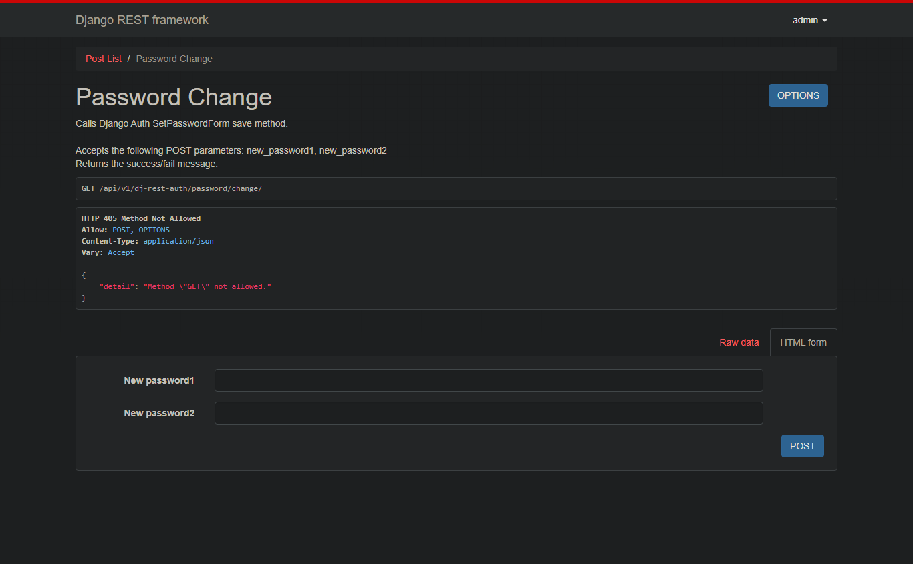
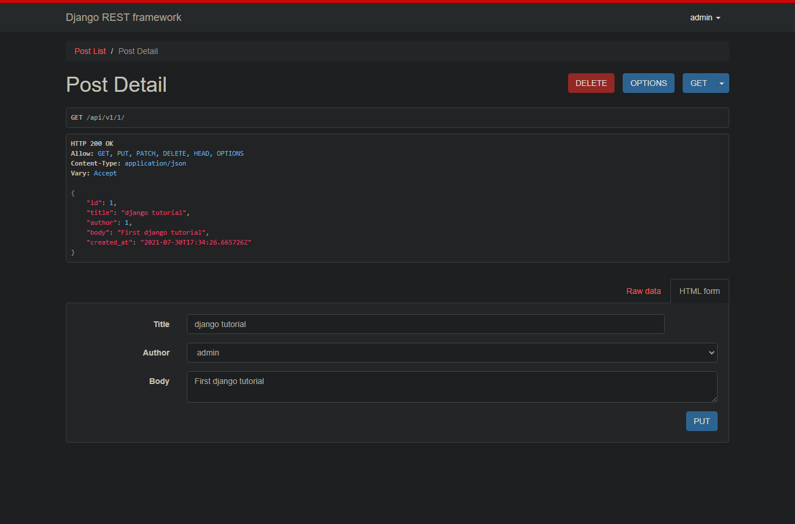
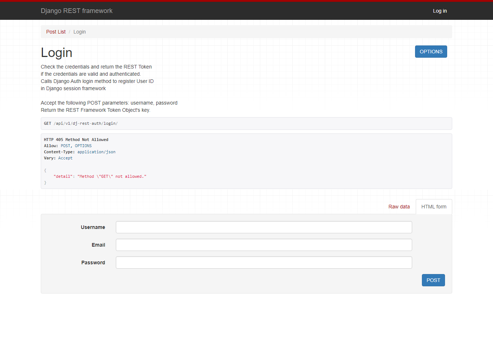

[comment]: <> (This is a comment, it will not be included)
[//]: <> (This is also a comment.)
[//]: # (This may be the most platform independent comment)

DFR | DFR
------------ | -------------
         | 
         | 
 | 
       | 
 | 
     | 

